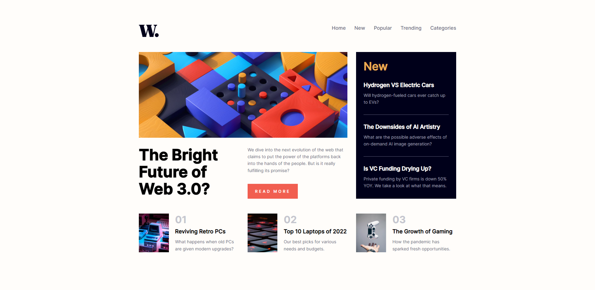
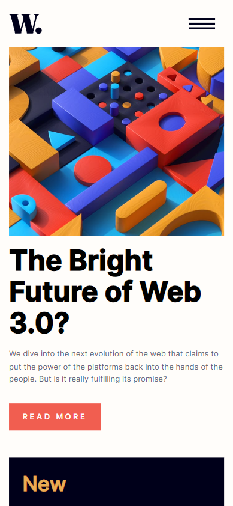

# Welcome

## Table of contents

- [Overview](#overview)
  - [Screenshot](#screenshot)
  - [Links](#links)
- [My process](#my-process)
  - [Built with](#built-with)
  <!-- - [What I learned](#what-i-learned) -->
  <!-- - [Continued development](#continued-development) -->
  <!-- - [Useful resources](#useful-resources) -->
- [Author](#author)

## Overview

This is a solution to the [News homepage challenge on Frontend Mentor](https://www.frontendmentor.io/challenges/news-homepage-H6SWTa1MFl). Frontend Mentor challenges help you improve your coding skills by building realistic projects. 

### Screenshot

|  |  |
| ------------------------------ | ----------------------------- |
| Desktop version                | Mobile version                |

### Links

<!-- - Solution URL: [Add solution URL here](https://your-solution-url.com) -->
- Live Site URL: [Netlify](https://tyran0-news-homepage.netlify.app/)

## My process

### Built with

- Semantic HTML5 markup
- CSS Flexbox & CSS Grid
- CSS Custom properties

<!-- ### What I learned -->

<!-- ### Continued development -->

<!-- ### Useful resources -->

## Author

- Frontend Mentor - [@tyran0](https://www.frontendmentor.io/profile/tyran0)